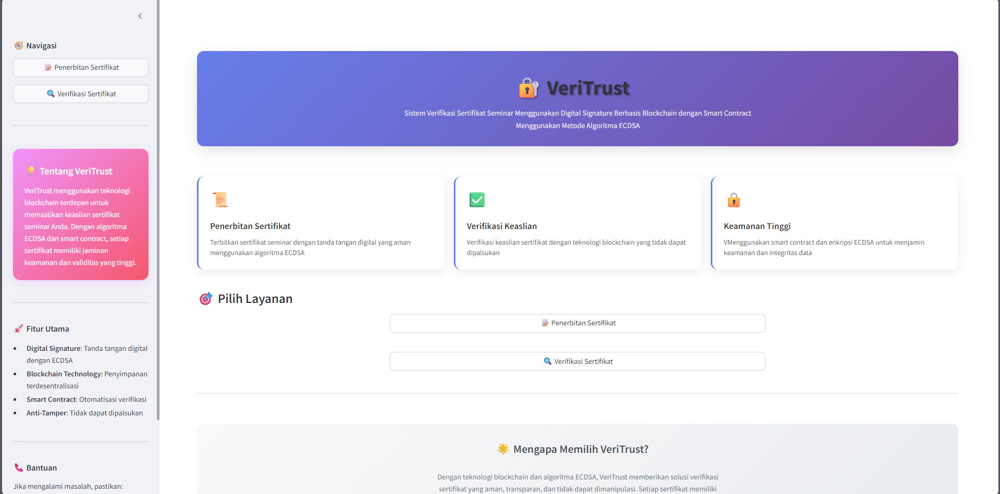

# 🔐 VeriTrust - Blockchain Certificate Verification System

### 🏠 Halaman Utama
<div align="center">
  
  <p><em>Interface utama dengan navigasi yang intuitif</em></p>
</div>

---

## 🌟 Tentang VeriTrust

VeriTrust adalah aplikasi web inovatif yang menggunakan teknologi blockchain untuk memverifikasi keaslian sertifikat seminar. Dengan menggabungkan algoritma ECDSA (Elliptic Curve Digital Signature Algorithm) dan smart contract Ethereum, sistem ini memberikan jaminan keamanan dan transparansi yang tinggi dalam penerbitan dan verifikasi sertifikat digital.

### 🎯 Mengapa VeriTrust?

- **🔒 Keamanan Tinggi**: Menggunakan algoritma ECDSA dan blockchain Ethereum
- **🚫 Anti-Pemalsuan**: Setiap sertifikat memiliki jejak digital yang unik
- **⚡ Verifikasi Instan**: Verifikasi keaslian dalam hitungan detik
- **🌐 Terdesentralisasi**: Menggunakan teknologi blockchain yang tidak dapat dimanipulasi
- **📱 User-Friendly**: Interface yang intuitif dan mudah digunakan

---

## ✨ Fitur Utama

### 📝 Penerbitan Sertifikat
- **Digital Signature**: Tanda tangan digital menggunakan algoritma ECDSA
- **PDF Generation**: Pembuatan sertifikat dalam format PDF otomatis
- **Blockchain Storage**: Penyimpanan hash sertifikat di blockchain Ethereum
- **Metadata Recording**: Pencatatan detail lengkap sertifikat

### 🔍 Verifikasi Sertifikat
- **Hash Verification**: Verifikasi integritas menggunakan SHA-256
- **Blockchain Validation**: Pengecekan keberadaan di blockchain
- **Digital Signature Check**: Validasi tanda tangan digital ECDSA
- **Certificate Status**: Pengecekan status aktif/revoked
- **Instant Results**: Hasil verifikasi real-time

### 🔧 Teknologi Backend
- **Smart Contract**: Kontrak pintar untuk manajemen sertifikat
- **ECDSA Algorithm**: Implementasi algoritma kurva eliptik
- **Web3 Integration**: Integrasi penuh dengan blockchain Ethereum
- **Cryptographic Security**: Enkripsi dan hashing tingkat enterprise

---

## 🛠️ Teknologi yang Digunakan

### Frontend & UI
- **Streamlit**: Framework aplikasi web Python
- **Custom CSS**: Styling modern dengan gradien dan animasi
- **Responsive Design**: Tampilan yang optimal di semua perangkat

### Blockchain & Crypto
- **Ethereum**: Platform blockchain utama
- **Web3.py**: Library Python untuk interaksi blockchain
- **Solidity**: Bahasa smart contract
- **ECDSA**: Algoritma tanda tangan digital

### PDF & Document Processing
- **ReportLab**: Generasi PDF dinamis
- **pyHanko**: Digital signature untuk PDF
- **PyPDF2**: Manipulasi dokumen PDF

### Security & Cryptography
- **eth-account**: Manajemen akun Ethereum
- **cryptography**: Library kriptografi Python
- **hashlib**: Fungsi hashing SHA-256

---

## 📋 Prasyarat Sistem

### Software Requirements
- **Python 3.8+**: Versi Python yang didukung
- **Node.js**: Untuk kompilasi smart contract (opsional)
- **Git**: Untuk cloning repository

### Network Requirements
- **Internet Connection**: Untuk akses blockchain Ethereum
- **Infura Account**: Untuk koneksi ke jaringan Ethereum

### Hardware Requirements
- **RAM**: Minimal 4GB (8GB direkomendasikan)
- **Storage**: 500MB ruang kosong
- **CPU**: Dual-core atau lebih tinggi

---

## 🚀 Panduan Instalasi

### 1. Clone Repository
```bash
git clone https://github.com/username/veritrust.git
cd veritrust
```

### 2. Setup Virtual Environment (Direkomendasikan)
```bash
# Buat virtual environment
python -m venv venv

# Aktivasi (Windows)
venv\Scripts\activate

# Aktivasi (Linux/Mac)
source venv/bin/activate
```

### 3. Instalasi Dependencies

#### Opsi A: Menggunakan Script Otomatis
```bash
python install.py
```

#### Opsi B: Instalasi Manual
```bash
pip install -r requirements.txt
```

### 4. Konfigurasi Environment Variables

Buat file `.env` di root directory:
```env
# Ethereum Network Configuration
INFURA_URL=https://sepolia.infura.io/v3/YOUR_PROJECT_ID
PRIVATE_KEY=your_private_key_here

# Smart Contract Address (setelah deployment)
CONTRACT_ADDRESS=0xYourContractAddress

# Optional: Network Configuration
NETWORK_NAME=sepolia
CHAIN_ID=11155111
```

### 5. Deploy Smart Contract (Opsional)
```bash
python deploy.py
```

### 6. Jalankan Aplikasi
```bash
streamlit run main.py
```

Aplikasi akan tersedia di: `http://localhost:8501`

---

## 📁 Struktur Project

```
veritrust/
├── 📄 main.py              # Aplikasi utama Streamlit
├── 📄 issue.py             # Modul penerbitan sertifikat
├── 📄 verify.py            # Modul verifikasi sertifikat
├── 📄 deploy.py            # Script deployment smart contract
├── 📄 install.py           # Script instalasi dependencies
├── 📄 requirements.txt     # Daftar dependencies
├── 📄 .env                 # Konfigurasi environment (buat sendiri)
├── 📁 contracts/          # Smart contracts Solidity
│   └── CertificateVerifier.sol
├── 📁 artifacts/          # Compiled contracts & deployment info
│   ├── CertificateVerifier.json
│   └── contract_info.json
├── 📁 certificates/       # Generated certificates
├── 📁 keys/              # Private keys & certificates
└── 📄 README.md          # Dokumentasi ini
```

---

## 🎮 Cara Penggunaan

### 📝 Menerbitkan Sertifikat Baru

1. **Akses Halaman Penerbitan**
   - Buka aplikasi di browser
   - Klik tombol "📝 Penerbitan Sertifikat"

2. **Isi Data Sertifikat**
   ```
   📋 Data yang Diperlukan:
   ├── Nama Peserta
   ├── Nama Seminar/Event
   ├── Tanggal Pelaksanaan
   ├── Lokasi Event
   ├── Nama Penyelenggara
   └── Deskripsi/Catatan (opsional)
   ```

3. **Generate Sertifikat**
   - Klik tombol "Generate Certificate"
   - Sistem akan membuat PDF dengan tanda tangan digital
   - Hash sertifikat disimpan ke blockchain

4. **Download & Verifikasi**
   - Download file PDF yang dihasilkan
   - Catat Certificate ID untuk verifikasi

### 🔍 Memverifikasi Sertifikat

1. **Akses Halaman Verifikasi**
   - Klik tombol "🔍 Verifikasi Sertifikat"

2. **Pilih Metode Verifikasi**
   
   **Opsi A: Upload PDF**
   - Upload file PDF sertifikat
   - Sistem akan ekstrak data dan hash
   
   **Opsi B: Input Manual**
   - Masukkan Certificate ID
   - Input hash sertifikat (opsional)

3. **Proses Verifikasi**
   ```
   🔄 Tahapan Verifikasi:
   ├── ✅ Validasi format sertifikat
   ├── ✅ Pengecekan hash integrity
   ├── ✅ Verifikasi blockchain record
   ├── ✅ Validasi digital signature
   └── ✅ Status certificate (active/revoked)
   ```

4. **Hasil Verifikasi**
   - Status: ✅ Valid / ❌ Invalid
   - Detail informasi sertifikat
   - Timestamp blockchain
   - Status tanda tangan digital

---

## 🔧 Konfigurasi Lanjutan

### Ethereum Network Setup

#### Sepolia Testnet (Recommended for Testing)
```env
INFURA_URL=https://sepolia.infura.io/v3/YOUR_PROJECT_ID
CHAIN_ID=11155111
NETWORK_NAME=sepolia
```

#### Ethereum Mainnet (Production)
```env
INFURA_URL=https://mainnet.infura.io/v3/YOUR_PROJECT_ID
CHAIN_ID=1
NETWORK_NAME=mainnet
```

### Smart Contract Configuration

1. **Compile Contract**
   ```bash
   # Install Solidity compiler
   pip install py-solc-x
   
   # Compile dan deploy
   python deploy.py
   ```

2. **Verify Deployment**
   ```bash
   # Check contract di Etherscan
   # Sepolia: https://sepolia.etherscan.io
   # Mainnet: https://etherscan.io
   ```

### PDF Signing Configuration

```python
# Konfigurasi di issue.py
PDF_SIGNATURE_CONFIG = {
    'signature_size': (200, 100),
    'signature_position': (400, 50),
    'cert_validity_days': 365,
    'hash_algorithm': 'sha256'
}
```

---

## 🧪 Testing & Development

### Unit Testing
```bash
# Install testing dependencies
pip install pytest pytest-cov

# Run tests
pytest tests/ -v --cov=.
```

### Local Blockchain Testing
```bash
# Install Ganache CLI
npm install -g ganache-cli

# Start local blockchain
ganache-cli --deterministic --accounts 10 --host 0.0.0.0

# Update .env untuk local testing
INFURA_URL=http://localhost:8545
CHAIN_ID=1337
```

### Debug Mode
```bash
# Jalankan dengan debug
streamlit run main.py --logger.level=debug
```

---

## 🔐 Keamanan

### Best Practices

1. **Private Key Management**
   - Jangan commit private key ke repository
   - Gunakan environment variables
   - Simpan backup di tempat aman

2. **Network Security**
   - Gunakan HTTPS untuk production
   - Validasi semua input pengguna
   - Implement rate limiting

3. **Smart Contract Security**
   - Audit kontrak sebelum deploy
   - Test di testnet dulu
   - Monitor gas usage

### Audit Checklist
- [ ] Private keys tidak ter-expose
- [ ] Input validation implemented
- [ ] Error handling comprehensive
- [ ] Logging untuk monitoring
- [ ] Backup & recovery plan

---

## 🐛 Troubleshooting

### Common Issues

#### 1. Connection Error
**Problem**: Tidak dapat connect ke blockchain
```
❌ Error: Could not connect to Ethereum network
```

**Solution**:
```bash
# Check network connection
ping 8.8.8.8

# Verify Infura URL
curl -X POST https://sepolia.infura.io/v3/YOUR_PROJECT_ID

# Update .env file
INFURA_URL=https://sepolia.infura.io/v3/YOUR_VALID_PROJECT_ID
```

#### 2. Gas Estimation Error
**Problem**: Transaction gagal karena gas
```
❌ Error: Gas estimation failed
```

**Solution**:
```python
# Increase gas limit in deploy.py
gas_estimate = 5000000  # Increase value
```

#### 3. PDF Generation Error
**Problem**: Error saat generate PDF
```
❌ Error: Could not generate PDF certificate
```

**Solution**:
```bash
# Reinstall PDF dependencies
pip uninstall reportlab pyHanko -y
pip install reportlab pyHanko --no-cache-dir
```

#### 4. Import Error
**Problem**: Module not found
```
❌ ModuleNotFoundError: No module named 'web3'
```

**Solution**:
```bash
# Reinstall all dependencies
pip install -r requirements.txt --force-reinstall
```

### Debug Commands
```bash
# Check Python version
python --version

# List installed packages
pip list

# Check Streamlit installation
streamlit --version

# Test Web3 connection
python -c "from web3 import Web3; print('Web3 OK')"
```